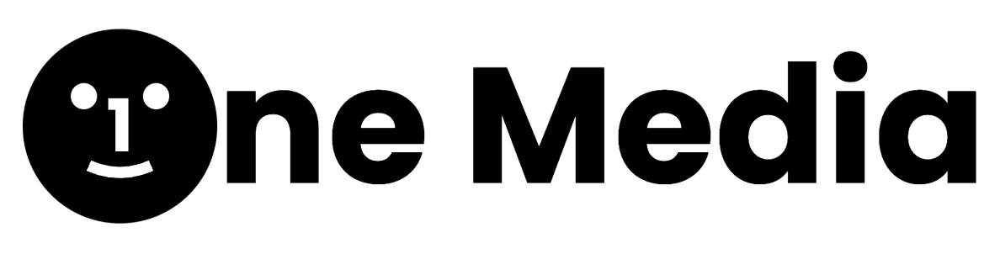

<a id="readme-top"></a>

[![Contributors][contributors-shield]][contributors-url]
[![Forks][forks-shield]][forks-url]
[![Stargazers][stars-shield]][stars-url]
[![Issues][issues-shield]][issues-url]
[![MIT License][license-shield]][license-url]

# OneMed1a - Unified Cross-Media Discovery App

<!-- PROJECT LOGO -->
<br />
<div align="center">
  <a href="https://github.com/SOFTENG-310-OneMed1a/OneMed1a_App/">
    
  </a>

  <h3 align="center"></h3>

  <p align="center">
    OneMedia is your personalised hub for movies, books, TV shows, music, and podcasts—powered by recommendations and social discovery.
    <br />
    <a href="https://github.com/SOFTENG-310-OneMed1a/OneMed1a_App/wiki"><strong>Explore the docs »</strong></a>
    <br />
    <br />
    <a href="https://github.com/SOFTENG-310-OneMed1a/OneMed1a_App/issues/new?template=bug_report.md">Report Bug</a>
    &middot;
    <a href="https://github.com/SOFTENG-310-OneMed1a/OneMed1a_App/issues/new?template=feature_request.md">Request Feature</a>
  </p>
</div>

---

<!-- TABLE OF CONTENTS -->
<details>
  <summary>Table of Contents</summary>
  <ol>
    <li>
      <a href="#about-the-project">About The Project</a>
      <ul>
        <li><a href="#why-is-this-project-useful">Why is this project useful?</a></li>
        <li><a href="#built-with">Built With</a></li>
        <li><a href="#apis-used">APIs Used</a></li>
      </ul>
    </li>
    <li>
      <a href="#getting-started">Getting Started</a>
      <ul>
        <li><a href="#prerequisites">Prerequisites</a></li>
        <li><a href="#setup-instructions">Setup Instructions</a></li>
        <li><a href="#configuration">Configuration</a></li>
        <li><a href="#troubleshooting">Troubleshooting</a></li>
      </ul>
    </li>
    <li><a href="#roadmap">Roadmap</a></li>
    <li>
      <a href="#contributing">Contributing</a>
      <ul>
        <li><a href="#top-contributors">Top Contributors</a></li>
        <li><a href="#team">Team</a></li>
      </ul>
    </li>
    <li><a href="#contact">Contact</a></li>
    <li><a href="#license">License</a></li>
    <li><a href="#acknowledgments">Acknowledgments</a></li>
  </ol>
</details>

---

## About the Project

This project is developed by **Team 5** (taken from **Team 4**) as part of the **University of Auckland SOFTENG 310 (Software Engineering Project)** course.
**OneMed1a** is a social and entertainment tracking web application that unifies users’ favorite media—movies, TV shows, books, and music—into one platform.

It enables users to:

- Track what they are watching, reading, or listening to
- Generate intelligent, cross-media recommendations (e.g., “you read this book, here’s the movie adaptation”)
- Connect with friends through a shared media activity feed
- Explore mood-aware and socially driven suggestions
<p align="right">(<a href="#readme-top">back to top</a>)</p>

---

## Why is this project useful?

Fragmented media platforms make it difficult to manage all the content people consume. **OneMed1a** addresses this by:

- Centralizing all media tracking in one place
- Recommending media across multiple domains (books to films, music to related shows, etc.)
- Offering a social feed of media activity among friends
- Suggesting top picks based on shared interests and friends’ ratings

This project also supports the SOFTENG 310 learning outcomes:

- Collaborative software development with GitHub
- Clear documentation and workflows
- Building maintainable and extensible software systems
<p align="right">(<a href="#readme-top">back to top</a>)</p>

---

### Built With

#### Frontend:

- [![JavaScript][JavaScript]][JavaScript-url]
- [![Next.js][Next.js]][Next-url]
- [![React][React.js]][React-url]

#### Backend:

- [![Docker][Docker]][Docker-url]
- [![Java][Java]][Java-url]
- [![Spring Boot][SpringBoot]][SpringBoot-url]
- [![PostgreSQL][PostgreSQL]][PostgreSQL-url]

---

## APIs Used

[![TMDB][TMDB]][TMDB-url]
[![Google Books][GoogleBooks]][GoogleBooks-url]
[![Spotify][Spotify]][Spotify-url]
[![OpenAI][OpenAI]][OpenAI-url]

Our system integrates with external APIs to provide rich metadata, covers, and media recommendations:

- 🎬 **TMDB API** — for Movies & TV Shows metadata and poster/backdrop images
- 📚 **Google Books API** — for Book metadata and cover images
- 🎵 **Spotify Web API** — for Music metadata and album covers
- 🤖 **OpenAI API** — for generating cross-media recommendation insights

### API Key Configuration

- **Frontend (Next.js)**: Keys are stored in `.env.local`
- **Backend (Spring Boot)**: Keys are configured in `application.properties`

> ⚠️ API keys should never be committed to Git. Use `.env.local` (ignored by default) and `application.properties` (with example templates provided).

Find more information on how to set up configuration files in the <a href="#configuration">Configuration</a> section.

<p align="right">(<a href="#readme-top">back to top</a>)</p>

---

## Getting Started

### Prerequisites

Install the following before setup:

- [Node.js](https://nodejs.org/) (v18+)
- [Java 21+](https://adoptium.net/)
- [Maven](https://maven.apache.org/)
- [Docker](https://www.docker.com/) or [Docker Desktop](https://www.docker.com/products/docker-desktop/) (for containerized PostgreSQL)
- [Git](https://git-scm.com/)

### Setup Instructions

1. **Clone the repository**

```bash
git clone https://github.com/SOFTENG-310-OneMed1a/OneMed1a_App.git
cd OneMed1a_App
```

2. **Run the database in Docker**

```bash
docker compose up -d
```

3. **Run the backend (Spring Boot)**

```bash
cd onemed1a-backend
mvn spring-boot:run
```

4. **Run the frontend (Next.js)**

```bash
cd ../onemed1a-frontend
npm install
npm run dev
```

5. **Run backend tests**

```bash
cd onemed1a-backend
mvn test
```

<p align="right">(<a href="#readme-top">back to top</a>)</p>

## Configuration

This project integrates with several APIs including Spotify, TMDB, Google Books, and OpenAI. To configure these services:

1. Navigate to `onemed1a-backend/src/main/resources/`
2. Copy `application.properties.example` to `application.properties`
3. Add your API keys and configuration details

For access to API keys and detailed configuration instructions, please contact:

- jkan172@aucklanduni.ac.nz
- kzhu796@aucklanduni.ac.nz
<p align="right">(<a href="#readme-top">back to top</a>)</p>

## Troubleshooting

### Backend Startup Problems

Reset Docker containers to resolve common backend issues:

1. **Ensure Docker is running:**

   - Open Docker Desktop (if using Windows/macOS)
   - Or start Docker service: `sudo systemctl start docker` (Linux)

2. **Reset containers:**

```bash
docker compose down -v    # Stop and remove containers
docker compose up -d      # Restart containers in background
```

<p align="right">(<a href="#readme-top">back to top</a>)</p>

# Roadmap

## ✅ Assignment 1 (Completed)

- [x] Backend API endpoints for media types (books, movies, TV, audio)
- [x] Frontend media listing & detail pages
- [x] Search functionality across all media types
- [x] Cross-media recommendation engine & recommendations page
- [x] API integrations for fetching external media data

---

## 🚧 Assignment 2 (In Progress)

- [ ] **Refactor backend structure** for maintainability and scalability
- [ ] **UI/UX redesign** (Figma prototypes → React components)
- [ ] Improved **navigation, layouts, and responsiveness**
- [ ] **Star rating system** for user feedback
- [ ] **User authentication & profiles** (sign up, login, account management)
- [ ] **Media reviews** (users can write and read reviews)
- [ ] **Personalized lists** (watchlist, reading list, playlists, etc.)
- [ ] **Backend test fixes** and expanded coverage
- [ ] **Bug fixes & performance improvements** from Assignment 1

See the [open issues](https://github.com/SOFTENG-310-OneMed1a/OneMed1a_App/issues) for a complete list of proposed features and known issues.

<p align="right">(<a href="#readme-top">back to top</a>)</p>

## Contributing

Contributions are what make the open source community such an amazing place to learn, inspire, and create. Any contributions you make are **greatly appreciated**.

If you have a suggestion that would make this better, please fork the repo and create a pull request. You can also simply open an issue with the tag "enhancement".
Don't forget to give the project a star! Thanks again!

1. Fork the Project
2. Create your Feature Branch (`git checkout -b feature/AmazingFeature`)
3. Commit your Changes (`git commit -m 'Add some AmazingFeature'`)
4. Push to the Branch (`git push origin feature/AmazingFeature`)
5. Open a Pull Request

### Top contributors:

<a href="https://github.com/SOFTENG-310-OneMed1a/OneMed1a_App/graphs/contributors">
  
</a>
<p align="right">(<a href="#readme-top">back to top</a>)</p>

### Team

Developed by **Team 5** — SOFTENG 310, University of Auckland

| Name                 | GitHub Username                                |
| -------------------- | ---------------------------------------------- |
| Oorja Gandhi         | [@oorjagandhi](https://github.com/oorjagandhi) |
| Kimberley Zhu        | [@kimkimz](https://github.com/kimkimz)         |
| Connie Ding          | [@connieding](https://github.com/connieding)   |
| Shihoo Park          | [@shewho1119](https://github.com/shewho1119)   |
| Richman Tan          | [@Richman-Tan](https://github.com/Richman-Tan) |
| JooHyun (Chris) Kang | [@jkan172](https://github.com/jkan172)         |

Originally developed by **Team 4** — SOFTENG 310, University of Auckland

| Name           |
| -------------- |
| Arnav Bhatiani |
| Dave Khadka    |
| Joe Nguyen     |
| Jake Kim       |
| Leo Chu        |
| Harry Ma       |

<p align="right">(<a href="#readme-top">back to top</a>)</p>

## Contact

For support or project-related discussions, join our Discord:
[Onemed1a](https://discord.gg/PdfgCVZQ)

<p align="right">(<a href="#readme-top">back to top</a>)</p>

## License

This project is licensed under the MIT License.
You are free to use, modify, and distribute with proper attribution.
See the LICENSE file for details.

<p align="right">(<a href="#readme-top">back to top</a>)</p>

## Acknowledgments

- [Best-README_Template](https://github.com/othneildrew/Best-README-Template)
- Kelly Blincoe the GOAT!!! 🐐

<p align="right">(<a href="#readme-top">back to top</a>)</p>

**_"One platform. All media. Shared together." — OneMed1a Team_**

<!-- MARKDOWN LINKS & IMAGES -->
<!-- https://www.markdownguide.org/basic-syntax/#reference-style-links -->

[contributors-shield]: https://img.shields.io/github/contributors/SOFTENG-310-OneMed1a/OneMed1a_App.svg?style=for-the-badge
[contributors-url]: https://github.com/SOFTENG-310-OneMed1a/OneMed1a_App/graphs/contributors
[forks-shield]: https://img.shields.io/github/forks/SOFTENG-310-OneMed1a/OneMed1a_App.svg?style=for-the-badge
[forks-url]: https://github.com/SOFTENG-310-OneMed1a/OneMed1a_App/network/members
[stars-shield]: https://img.shields.io/github/stars/SOFTENG-310-OneMed1a/OneMed1a_App.svg?style=for-the-badge
[stars-url]: https://github.com/SOFTENG-310-OneMed1a/OneMed1a_App/stargazers
[issues-shield]: https://img.shields.io/github/issues/SOFTENG-310-OneMed1a/OneMed1a_App.svg?style=for-the-badge
[issues-url]: https://github.com/SOFTENG-310-OneMed1a/OneMed1a_Appissues
[license-shield]: https://img.shields.io/github/license/SOFTENG-310-OneMed1a/OneMed1a_App.svg?style=for-the-badge
[license-url]: https://github.com/SOFTENG-310-OneMed1a/OneMed1a_App/blob/master/LICENSE.txt
[product-screenshot]: images/screenshot.png
[SpringBoot]: https://img.shields.io/badge/Spring%20Boot-6DB33F?style=for-the-badge&logo=springboot&logoColor=white
[SpringBoot-url]: https://spring.io/projects/spring-boot
[Next.js]: https://img.shields.io/badge/next.js-000000?style=for-the-badge&logo=nextdotjs&logoColor=white
[Next-url]: https://nextjs.org/
[Docker]: https://img.shields.io/badge/Docker-2496ED?style=for-the-badge&logo=docker&logoColor=white
[Docker-url]: https://www.docker.com/
[PostgreSQL]: https://img.shields.io/badge/PostgreSQL-336791?style=for-the-badge&logo=postgresql&logoColor=white
[PostgreSQL-url]: https://www.postgresql.org/
[JavaScript]: https://img.shields.io/badge/JavaScript-F7DF1E?style=for-the-badge&logo=javascript&logoColor=black
[JavaScript-url]: https://developer.mozilla.org/en-US/docs/Web/JavaScript
[Java]: https://img.shields.io/badge/Java-007396?style=for-the-badge&logo=java&logoColor=white
[Java-url]: https://www.java.com/
[TMDB]: https://img.shields.io/badge/TMDB-01D277?style=for-the-badge
[TMDB-url]: https://www.themoviedb.org/
[GoogleBooks]: https://img.shields.io/badge/Google%20Books-4285F4?style=for-the-badge&logo=google
[GoogleBooks-url]: https://developers.google.com/books
[Spotify]: https://img.shields.io/badge/Spotify-1DB954?style=for-the-badge&logo=spotify&logoColor=white
[Spotify-url]: https://developer.spotify.com/
[OpenAI]: https://img.shields.io/badge/OpenAI-412991?style=for-the-badge&logo=openai&logoColor=white
[OpenAI-url]: https://platform.openai.com/
[React.js]: https://img.shields.io/badge/React-20232A?style=for-the-badge&logo=react&logoColor=61DAFB
[React-url]: https://reactjs.org/
